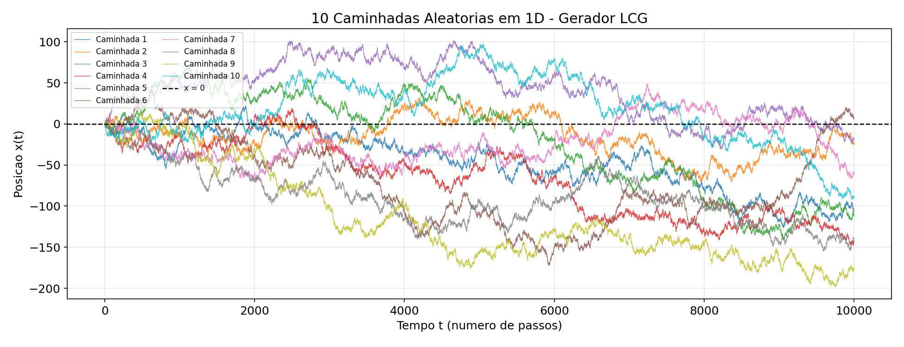
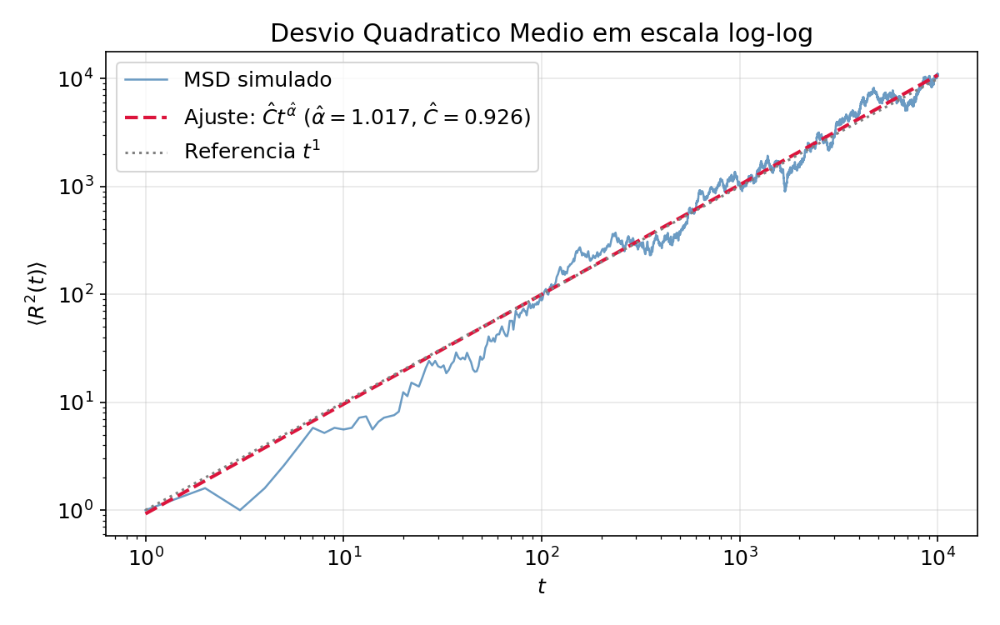
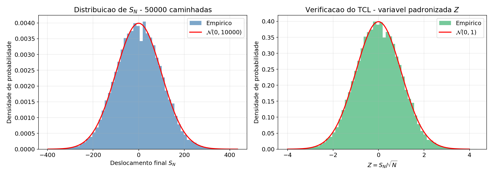

# Prática: Gerador de Random Walk e Monte Carlo

## Objetivo

Assimilar o conceito de caminhadas aleatórias e implementar o método de Monte Carlo por meio de um gerador pseudoaleatório congruencial linear (LCG), verificando analiticamente e estatisticamente as propriedades do random walk simples em 1D.

## Repositório

Código-fonte e notebooks da prática disponíveis em:
[`PrincipioModelagemMatematica/Trabalhos/PraticaGeradorRandonWalk`](https://github.com/LeonardoVieiraGuimaraes/DoutoradoCefet/tree/main/PrincipioModelagemMatematica/Trabalhos/PraticaGeradorRandonWalk)

---

## Fluxo Matemático

```
┌─────────────────────────────────┐
│  1. LCG → números pseudo-       │
│     aleatórios uniformes        │
└────────────────┬────────────────┘
                 │  u_n ∈ [0,1)
                 ▼
┌─────────────────────────────────┐
│  2. Binarização → passos ±1     │
│     Acúmulo → trajetória x(t)   │
└────────────────┬────────────────┘
                 │  10 caminhadas, N=10 000
                 ▼
┌─────────────────────────────────┐
│  3. MSD ⟨R²(t)⟩ + ajuste       │
│     log-log → lei de potência   │
└────────────────┬────────────────┘
                 │  α̂, C, R²
                 ▼
┌─────────────────────────────────┐
│  4. Teste t bilateral           │
│     H₀: α = 1                  │
└────────────────┬────────────────┘
                 │  decisão
                 ▼
┌─────────────────────────────────┐
│  5. TCL: 50 000 caminhadas      │
│     Z = S_N/√N → N(0,1)?        │
│     Teste Kolmogorov-Smirnov    │
└─────────────────────────────────┘
```

---

## Etapa 1 — Gerador Linear Congruencial (LCG)

### Fundamento matemático

O LCG é definido pela recorrência de três parâmetros:

$$x_{n+1} = (a\,x_n + c) \bmod m$$

| Parâmetro | Símbolo | Valor utilizado |
|---|---|---|
| Multiplicador | $a$ | `1 664 525` |
| Incremento | $c$ | `1 013 904 223` |
| Módulo | $m$ | $2^{32} = 4\,294\,967\,296$ |

Os valores satisfazem o **teorema de Hull-Dobell**, que garante período máximo $m$:
- $\gcd(c, m) = 1$
- $a - 1$ é divisível por todo fator primo de $m$
- Se $4 \mid m$, então $4 \mid (a-1)$

### Normalização para $[0, 1)$

$$u_n = \frac{x_n}{m}, \quad u_n \in [0, 1)$$

### Geração dos passos

$$\xi_n = \begin{cases} +1 & \text{se } u_n < \tfrac{1}{2} \\ -1 & \text{se } u_n \geq \tfrac{1}{2} \end{cases}$$

Cada $\xi_n$ é uma variável de Rademacher com $P(\xi_n=+1)=P(\xi_n=-1)=\frac{1}{2}$, logo $\mathbb{E}[\xi_n]=0$ e $\text{Var}(\xi_n)=1$.

---

## Etapa 2 — Simulação das Trajetórias

### Posição como soma parcial

A posição do caminhante no instante $t$ é:

$$S_t = \sum_{n=1}^{t} \xi_n, \quad S_0 = 0$$

### Parâmetros da simulação

| Grandeza | Valor |
|---|---|
| Número de caminhadas | 10 |
| Passos por caminhada ($N$) | 10 000 |
| Semente da caminhada $i$ | $\text{seed}_i = i \times 12\,345$ |

### Propriedades teóricas de cada trajetória

$$\mathbb{E}[S_t] = 0 \qquad \text{Var}(S_t) = t$$

As trajetórias crescem em amplitude como $\sqrt{t}$, sem tendência sistemática.



---

## Etapa 3 — Desvio Quadrático Médio e Lei de Potência

### Definição do MSD (Mean Squared Displacement)

Para cada instante $t$, o desvio quadrático médio sobre as $M=10$ caminhadas é:

$$\langle R^2(t) \rangle = \frac{1}{M} \sum_{i=1}^{M} S_i(t)^2$$

### Previsão teórica

Para random walk simples: $\langle R^2(t) \rangle = t$, ou seja, lei de potência com expoente unitário:

$$\langle R^2(t) \rangle = C \, t^{\alpha}, \quad \alpha_{\text{teórico}} = 1$$

### Ajuste log-log (linearização)

Aplicando logaritmo:

$$\ln\langle R^2(t) \rangle = \alpha \ln t + \ln C$$

Fazendo $Y = \ln\langle R^2\rangle$ e $X = \ln t$, o problema se reduz a regressão linear $Y = \alpha X + \beta$, com $\beta = \ln C$. O estimador de mínimos quadrados ordinários fornece:

$$\hat{\alpha} = \frac{\sum (X_i - \bar{X})(Y_i - \bar{Y})}{\sum (X_i - \bar{X})^2}, \qquad \hat{\beta} = \bar{Y} - \hat{\alpha}\,\bar{X}$$

### Resultados obtidos

| Parâmetro | Valor estimado |
|---|---|
| $\hat{\alpha}$ | **1,016797** |
| $\hat{C} = e^{\hat{\beta}}$ | **0,9261** |
| $R^2$ do ajuste | **0,9608** |

$$\langle R^2(t) \rangle \approx 0{,}9261 \; t^{1{,}0168}$$



---

## Etapa 4 — Teste de Hipótese para o Expoente $\alpha$

### Formulação

$$H_0: \alpha = 1 \quad \text{(random walk verdadeiro)}$$
$$H_1: \alpha \neq 1 \quad \text{(bilateral, nível } \alpha = 5\%\text{)}$$

### Erro padrão do estimador

A partir da matriz de covariância do ajuste por mínimos quadrados:

$$\text{SE}(\hat{\alpha}) = \sqrt{\frac{\hat{\sigma}^2}{\sum (X_i - \bar{X})^2}}, \quad \hat{\sigma}^2 = \frac{\sum \hat{\varepsilon}_i^2}{n - 2}$$

### Estatística de teste

$$t = \frac{\hat{\alpha} - 1}{\text{SE}(\hat{\alpha})} \;\sim\; t_{n-2} \quad \text{sob } H_0$$

### Resultados do teste

| Grandeza | Valor |
|---|---|
| $\hat{\alpha}$ | 1,016797 |
| $\text{SE}(\hat{\alpha})$ | 0,002053 |
| $t_{\text{calculado}}$ | **8,1807** |
| Graus de liberdade | 9 998 |
| $t_{\text{crítico}}$ (5%, bilateral) | 1,9602 |
| $p$-valor | $3{,}17 \times 10^{-16}$ |

### Decisão

$$|t_{\text{calc}}| = 8{,}18 > t_{\text{crit}} = 1{,}96 \implies \textbf{rejeita-se } H_0$$

> **Interpretação:** embora $\hat{\alpha} = 1{,}0168$ seja numericamente próximo de 1, o $p$-valor ínfimo indica que o desvio é estatisticamente significativo dado o número de pontos ($n = 10\,000$). Na prática, o comportamento difusivo é confirmado — a diferença de $1{,}68\%$ em relação a $\alpha = 1$ reflete flutuações inerentes às apenas 10 amostras usadas no cômputo do MSD.

---

## Etapa 5 — Verificação do Teorema Central do Limite (TCL)

### Enunciado (aplicado ao random walk)

Seja $S_N = \sum_{n=1}^N \xi_n$ o deslocamento final após $N$ passos. Como $\mathbb{E}[\xi_n]=0$ e $\text{Var}(\xi_n)=1$, o TCL garante:

$$Z_N = \frac{S_N}{\sqrt{N}} \xrightarrow{\;\mathcal{D}\;} \mathcal{N}(0, 1) \quad \text{quando } N \to \infty$$

### Procedimento

1. Gerar **50 000 caminhadas** independentes, cada uma com $N = 10\,000$ passos.
2. Coletar os deslocamentos finais $\{S_N^{(i)}\}_{i=1}^{50000}$.
3. Normalizar: $Z^{(i)} = S_N^{(i)} / \sqrt{N}$.
4. Comparar o histograma de $Z^{(i)}$ com a densidade $\mathcal{N}(0,1)$.
5. Aplicar o teste **Kolmogorov-Smirnov** para quantificar a aderência:

$$D = \sup_{z} \left| F_n(z) - \Phi(z) \right|$$

onde $F_n$ é a FDA empírica e $\Phi$ é a FDA normal padrão.

### Resultados

| Métrica | Valor |
|---|---|
| $\bar{Z}$ (média empírica) | $8{,}0 \times 10^{-5} \approx 0$ |
| $\sigma_Z$ (desvio padrão empírico) | **0,9863** |
| Estatística KS ($D$) | **0,01273** |
| $p$-valor KS | **0,3895** |

### Decisão KS

$$p\text{-valor} = 0{,}3895 > 0{,}05 \implies \textbf{não se rejeita normalidade}$$

> **Conclusão:** os deslocamentos finais normalizados $Z = S_N / \sqrt{N}$ são compatíveis com $\mathcal{N}(0,1)$, confirmando o TCL numericamente.



---

## Resultados Consolidados

| Etapa | Resultado | Conclusão |
|---|---|---|
| LCG | período $= 2^{32}$, $u_n \sim U(0,1)$ | Gerador válido |
| 10 caminhadas | trajetórias sem tendência, amplitude $\sim \sqrt{t}$ | Comportamento difusivo |
| MSD log-log | $\hat{\alpha} = 1{,}0168$, $R^2 = 0{,}9608$ | Lei de potência confirmada |
| Teste $t$ | $t = 8{,}18$, $p = 3{,}2\times10^{-16}$ | $H_0$ rejeitada (desvio pequeno mas significativo) |
| TCL (KS) | $D = 0{,}013$, $p = 0{,}39$ | Gaussianidade confirmada |

---

## Estrutura do Repositório

```
PraticaGeradorRandonWalk/
├── README.md
├── trabalho.txt              # Enunciado original
├── src/
│   ├── random_wlak.ipynb     # Notebook principal (etapas 1–5)
│   ├── gera_tabela_latex_copia_graficos.ipynb
│   ├── dados/                # CSVs gerados
│   └── graficos/             # Figuras exportadas
└── relatorioCefet/           # Relatório ABNT em LaTeX
    ├── meu-trabalho.tex
    ├── referencias.bib
    └── elementos-textuais/
```

## Referências

- Hull, T. E.; Dobell, A. R. *Random Number Generators*. **SIAM Review**, v. 4, n. 3, p. 230–254, 1962. DOI: [10.1137/1004061](https://doi.org/10.1137/1004061)
- Weisstein, E. W. *Random Walk — 1-Dimensional*. MathWorld. Disponível em: <https://mathworld.wolfram.com/RandomWalk1-Dimensional.html>
- NIST. *Kolmogorov-Smirnov Goodness-of-Fit Test*. NIST/SEMATECH e-Handbook. Disponível em: <https://www.itl.nist.gov/div898/handbook/eda/section3/eda35g.htm>
